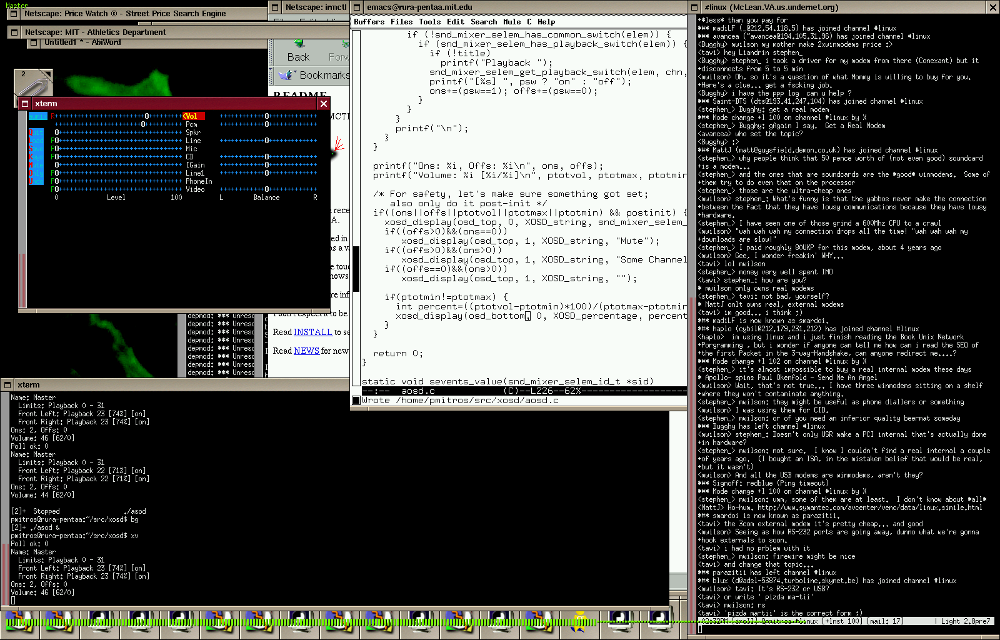

AOSD
====

A long, long time ago (2002), I wrote a little utility that used xosd
and ALSA events to show volume bars whenever the volume changed (I was
trying to make my desktop pretty). See the screenshot for a better
idea:

As the screenshot makes obvious, I wrote this in the days of
Netscape. I have no idea if it works today. This was also designed
purely for personal use on my machine. It may not work anywhere else.

I threw up the source code on my web page, with no project web page,
and essentially no documentation. I then forgot all about it, and the
code began to bit rot. To my great surprise, someone found it, and
used it. Indeed, when the xosd API changed, Marek Szuba of CERN sent a
patch (2008) to make aosd work again. In response to the patch, I
created a web page for it.

Shortly thereafter, Marek generously agreed to continue maintaining
aosd, so future updates were be on his [aosd web
page](http://aosd.sourceforge.net/) on SourceForge. I rather prefer
when things on the Internet don't disappear, so I kept the page up for
historical reasons. In 2016, Sourceforge was on the way out, and a
tarball on my personal page seemed quaint, so I placed a copy on
github. The SourceForge page is canonical, though, so long as it is
still up. Marek is the maintainer. 

Compile with: `gcc aosd.c -lxosd -lasound -oaosd`

I have not tested Marek's patch, since I no longer use aosd
    myself, but I did read it to confirm that it contains no hostile
    code.

The code is distributed under the GNU General Public License,
    and comes with no warranty.

Copyright (c) 2003-2016. Piotr Mitros.
